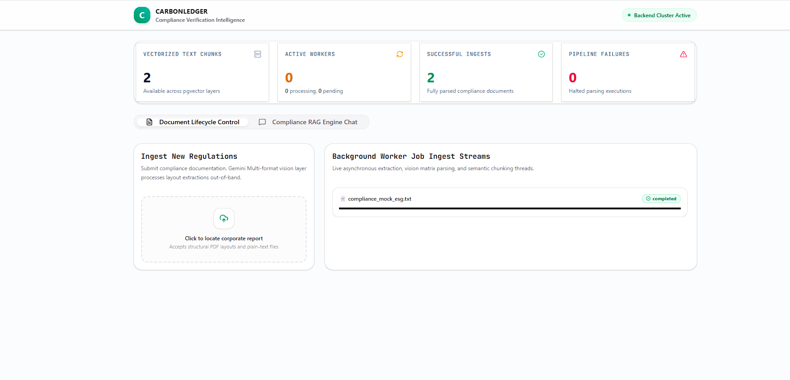
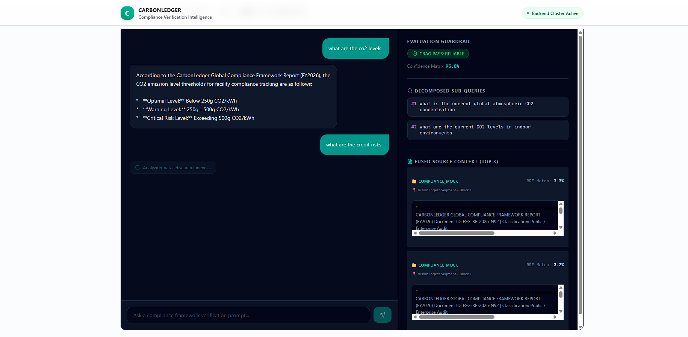

# Carbon Ledger Analytics & Ingestion Platform

A high-performance, event-driven, decoupled platform architected to parse unstructured corporate climate compliance documents, extract environmental telemetries using Multimodal Vision AI, and execute deterministic financial risk models.




---

## 🏗️ Architectural Overview

The platform enforces strict separation of concerns by decoupling heavy document-ingestion workloads from latency-sensitive analytical APIs. It uses a split-pool PostgreSQL topology to support asymmetric read/write traffic patterns commonly found in regulatory compliance systems.

```text
[ React / Vite Frontend Dashboard ]
                    │
          HTTP / Web API Layer
                    │
      ┌─────────────┴─────────────┐
      ▼                           ▼
[ Primary Cluster: 5433 ]   [ Read Replica: 5434 ]
   (Write Workloads)         (Analytics Queries)
      │                           ▲
 Async Task Worker                │
 (Gemini Pipeline) ───────────────┘
```

### Frontend Dashboard

A React + TypeScript application featuring:

* Real-time ingestion monitoring
* Progress tracking
* Reactive analytics dashboards
* Accessibility-compliant UI controls

### API Gateway (FastAPI)

Provides asynchronous routing for:

* Document ingestion
* Analytics retrieval
* Operational diagnostics
* Platform telemetry

### Analytical Services

Dedicated computation engines responsible for:

* Regulatory exposure calculations
* Deterministic financial risk modeling
* Verification workflows that reduce AI hallucinations

### Ingestion Pipeline

Background task workers powered by:

* `google-genai`
* `asyncpg`
* Gemini Vision Models

Responsible for:

* Document parsing
* Structural extraction
* Markdown generation
* Telemetry generation

### Storage Topology

A split-pool PostgreSQL architecture:

| Component        | Port | Responsibility                    |
| ---------------- | ---- | --------------------------------- |
| Primary Database | 5433 | Writes & Transactional Operations |
| Read Replica     | 5434 | Analytics & Read Queries          |

---

# 📂 Project Structure

```text
backend/app/
├── api/
│   ├── endpoints.py
│   └── routers/
│       ├── analytics.py
│       └── documents.py
│
├── services/
│   └── risk_engine.py
│
├── workers/
│   └── ingestion_worker.py
│
└── db/
    └── session.py
```

### Component Responsibilities

| File                | Description                              |
| ------------------- | ---------------------------------------- |
| endpoints.py        | Operational diagnostics & telemetry      |
| analytics.py        | Green finance analytics APIs             |
| documents.py        | Document ingestion APIs                  |
| risk_engine.py      | Exposure calculations & extraction logic |
| ingestion_worker.py | Gemini Vision ingestion pipeline         |
| session.py          | Primary/Replica routing                  |

---

# 🔍 Low-Level Design (LLD)

## Backend Architecture

The backend is built around stateless asynchronous execution patterns.

```text
[HTTP Request]
       │
       ▼
[FastAPI Router]
       │
       ▼
[Dependency Injection Layer]
       │
       ▼
[ClimateRiskService]
       │
       ▼
[asyncpg Connection Pool]
```

### Async Database Layer

Uses raw `asyncpg` connection pools instead of traditional ORMs to achieve:

* Lower overhead
* Faster execution
* Explicit connection management
* Improved scalability

### Service Layer

`ClimateRiskService` provides:

* `run_dynamic_extraction()`
* `get_analytics()`

The service remains stateless and receives database dependencies through FastAPI injection.

### Concurrency Safety

The ingestion subsystem implements:

* Safe async connection handling
* Pool exhaustion prevention
* Deadlock mitigation
* Concurrent upload processing

---

## Frontend Architecture

The frontend uses React state composition over strongly typed TypeScript models.

```text
[User Upload]
      │
      ▼
[DocumentManager]
      │
      ▼
[Polling Engine]
      │
      ▼
[ClimateRiskWidget]
```

### Polling Engine

Implemented through React Hooks:

```tsx
useEffect(...)
```

Responsibilities:

* Track ingestion jobs
* Poll worker status
* Synchronize dashboard state

### Accessibility (A11y)

Features include:

* `aria-label` support
* Keyboard navigation
* `role="button"`
* Enter/Space execution handlers

### Hydration Isolation

Components use defensive rendering:

```tsx
if (!data) return null;
```

This prevents rendering before API payloads are available.

---

# 🧠 Advanced RAG & Native Vector Search

The platform integrates Retrieval-Augmented Generation (RAG) directly into PostgreSQL using the `pgvector` extension.

```text
[Raw Text Chunk]
        │
        ▼
[Embedding Model]
        │
        ▼
[Vector Embedding]
        │
        ▼
[PostgreSQL pgvector]
        ▲
        │
[User Query]
```

---

## Database Schema

```sql
CREATE TABLE compliance_documents (
    id SERIAL PRIMARY KEY,
    task_id UUID NOT NULL,
    raw_text_chunk TEXT NOT NULL,
    embedding VECTOR(1536)
);
```

### HNSW Index

```sql
CREATE INDEX compliance_vector_hnsw_idx
ON compliance_documents
USING hnsw (embedding vector_cosine_ops);
```

This enables sub-millisecond nearest-neighbor search.

---

## Retrieval Workflow

### 1. Query Expansion

User prompts are transformed into multiple contextual sub-queries.

### 2. Vector Similarity Search

```sql
SELECT
    raw_text_chunk,
    (embedding <=> :query_embedding) AS distance
FROM compliance_documents
WHERE (embedding <=> :query_embedding) < 0.35
ORDER BY distance ASC
LIMIT 5;
```

### 3. Verification Layer

Retrieved context is injected into the LLM prompt together with strict behavioral constraints.

Benefits:

* Reduced hallucinations
* Deterministic calculations
* Auditable outputs

---

# 🔄 Data Lifecycle

```text
[PDF Upload]
      │
      ▼
[FastAPI Router]
      │
      ▼
[Background Worker]
      │
      ▼
[Gemini Vision Parser]
      │
      ▼
[Primary Database]
      │
      ▼
[Read Replica]
      │
      ▼
[Analytics Dashboard]
```

---

## Processing Flow

### 1. Ingestion

Documents are uploaded through:

```http
POST /api/documents/upload
```

The API creates an ingestion task and marks it as `pending`.

---

### 2. AI Extraction

The ingestion worker sends documents to:

```text
gemini-2.5-flash
```

The model extracts:

* Tables
* Charts
* Structured text
* Environmental metrics

Outputs are converted into normalized Markdown.

---

### 3. Deterministic Analytics

The parser identifies patterns such as:

```regex
Facility-\d+
```

and

```regex
\$(\d+)\s*regulatory penalty
```

Projected liability is calculated using:

[
Projected\ Liability =
Base\ Exposure \times
(1 + (FacilityIndex \times 0.15))
]

---

### 4. Persistence

Results are written to:

```text
Primary DB (5433)
```

and replicated to:

```text
Read Replica (5434)
```

---

### 5. Dashboard Hydration

Analytics endpoints query the replica and return processed telemetry to the frontend in milliseconds.

---

# 🛠️ Docker Orchestration

## Launch Entire Stack

```bash
docker compose up --build -d
```

---

## View Logs

Stream logs from all services:

```bash
docker compose logs -f
```

Backend only:

```bash
docker compose logs -f backend
```

Frontend only:

```bash
docker compose logs -f frontend
```

---

# 🚀 Local Development (Without Docker)

## Start Databases

```bash
docker compose up -d db-primary db-replica
```

---

## Start Backend

```bash
uvicorn app.main:app --reload --port 8000
```

---

## Start Frontend

```bash
npm install
npm run dev
```

---

# ✨ Key Technical Highlights

* FastAPI asynchronous architecture
* Gemini Vision document intelligence
* PostgreSQL Primary/Replica topology
* Native PostgreSQL vector search (`pgvector`)
* HNSW indexing
* Deterministic financial risk calculations
* Async task execution
* Accessibility-compliant React UI
* Containerized deployment via Docker Compose
* Hallucination-resistant analytics workflows

---

# 📜 License

This project is intended as a reference implementation for AI-powered climate compliance analytics, multimodal document ingestion, and deterministic financial risk assessment workflows.
